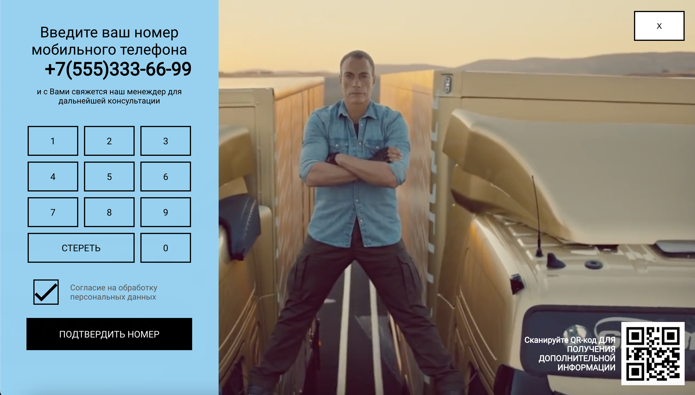
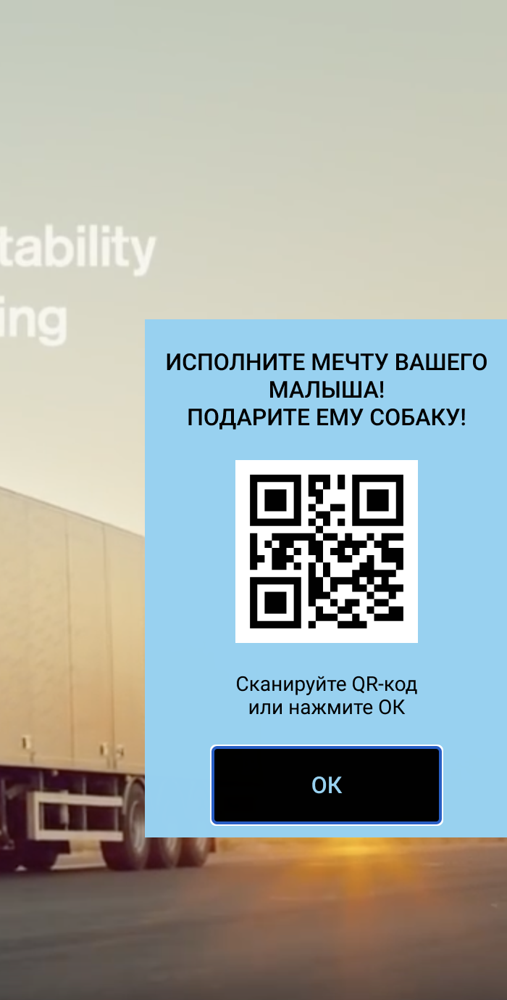
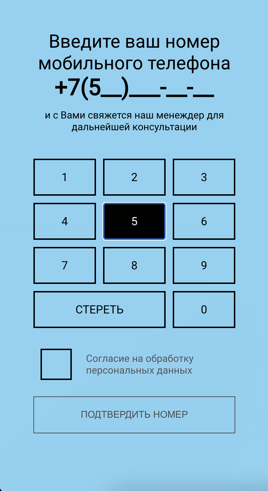
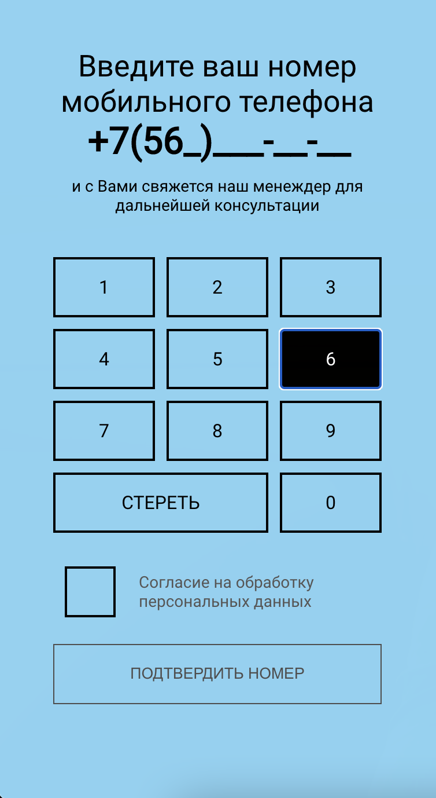

<h1> Smart-TV Demo </h1>

Advertising Smart-TV microsite built for job interview 

Demo: https://smart-tv-demo.vercel.app

<h2> Screenshots: </h2>



<h3> Keyboard navigation available:</h3>
Use "tab" + "enter" to navigate on menu items and arrow keys + "enter" to input digits
<p float="left">
 
 
 
 
</p>
Also you can use numpad to put digits in place


<h2> To run locally: </h2>
 
```
git clone git@github.com:100whitebirds/smart-tv-demo.git
```
```
npm install
```
```
npm start
```
