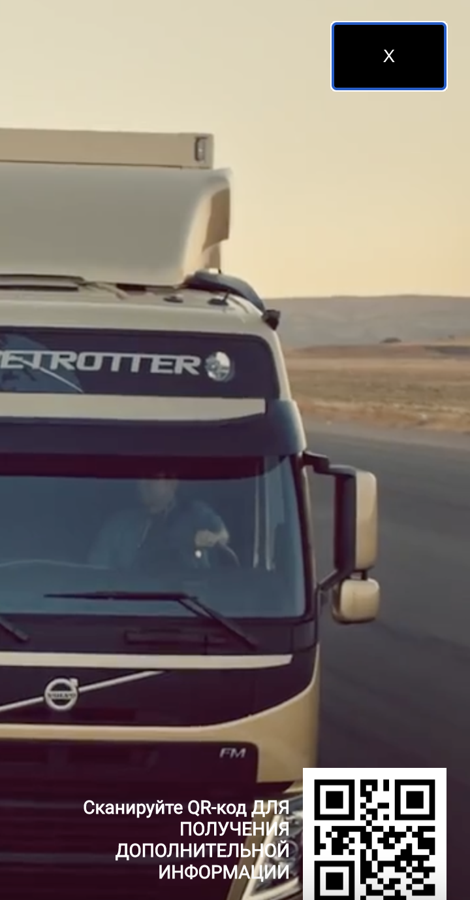

<h1> Smart-TV Demo </h1>

Advertising Smart-TV microsite built for job interview 

Demo: https://smart-tv-demo.vercel.app

<h2> Screenshots: </h2>


<h3> Keyboard navigation available</h3>

Use "tab" to navigate and "enter" to submit:
<br/><br/>

<p float="left">
 
 
</p>

Use arrow keys to navigate and "enter" to submit:
<br/><br/>

<p float="left">
 
 
</p>


<h2> To run locally: </h2>
 
```
git clone git@github.com:100whitebirds/smart-tv-demo.git
```
```
npm install
```
```
npm start
```
